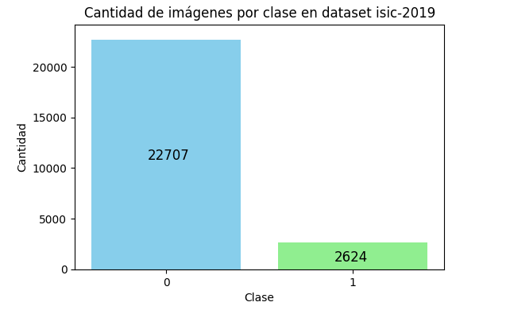
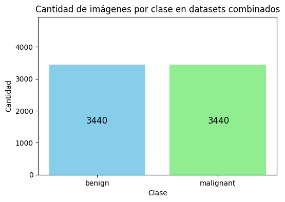
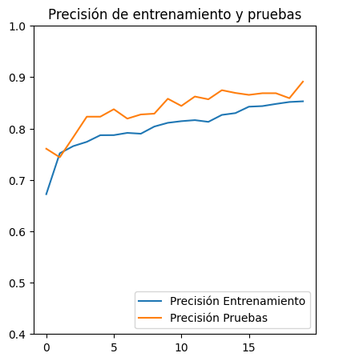
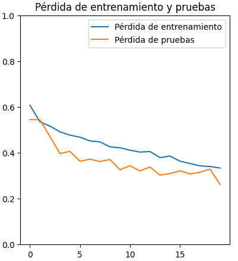
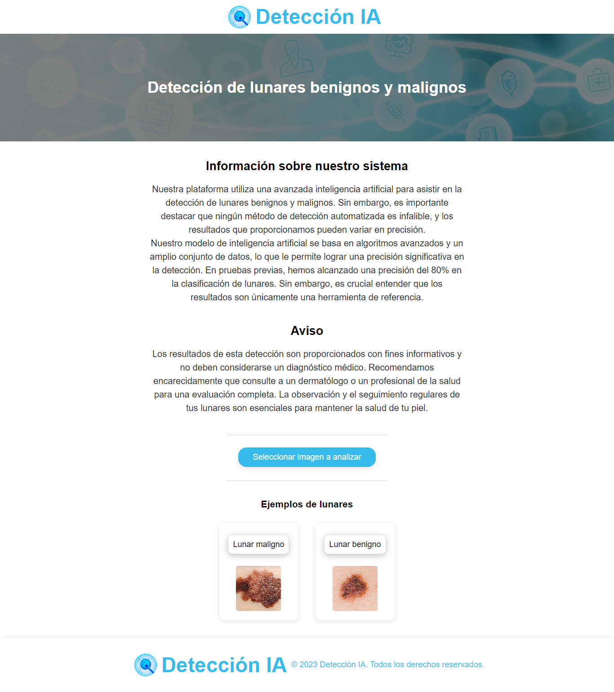

= TP Inicial - Laboratorio de Construcción de Software - Entrega 4
Ebertz Ximena <xebertz@campus.ungs.edu.ar>; Gross Pablo <pablorubengross@gmail.com>; López Gonzalo <gonzagonzalopez20@gmail.com>
v1, {docdate}
:toc:
:title-page:
:toc-title: Secciones
:numbered:
:source-highlighter: coderay
:tabsize: 4
:nofooter:
:pdf-page-margin: [3cm, 3cm, 3cm, 3cm]

== Introducción

En este documento, abordaremos los distintos pasos y los problemas surgidos en la implementación en la nube de nuestro modelo de clasificación de lunares. Explicaremos por qué debimos realizar un cambio en la arquitectura de nuestro modelo, motivo estrictamente relacionado con los datos utilizados para el entrenamiento. Finalmente, analizaremos el nuevo modelo y su implementación en la nube.

== Desarrollo

Como primer paso, partiendo desde nuestro modelo convolucional generado en la _entrega 3_, procedimos a su implementación en la nube.

.arquitectura de la red convolucional generada en la tercer entrega
[source, python]
----
modelo_cnn = tf.keras.models.Sequential([
    tf.keras.layers.Conv2D(16, (3, 3), activation = 'relu', input_shape = (100, 100, 3)),
    tf.keras.layers.MaxPooling2D(3, 3),

    tf.keras.layers.Dropout(0.5),
    tf.keras.layers.Flatten(),
    tf.keras.layers.Dense(64, activation = 'relu'),
    tf.keras.layers.Dropout(0.2),
    tf.keras.layers.Dense(32, activation = 'relu'),
    tf.keras.layers.Dropout(0.5),
    tf.keras.layers.Dense(1, activation = 'sigmoid')
])

#Compilación
modelo_cnn.compile(optimizer='adam',
              loss='binary_crossentropy',
              metrics=['accuracy'])

----

Este modelo tiene una precisión del 85%, y un nivel de error de menos del 40%, lo que lo hace lo suficientemente bueno para su implementación. Sin embargo, nos encontramos con un nuevo problema: el modelo no era lo suficientemente preciso con imágenes brindadas por el usuario. Las predicciones tendían a ser mayoritariamente malignas, con lunares benignos. Esto hizo que realicemos distintas pruebas para mejorar su precisión y corregir esta tendencia.

=== Pruebas

En principio, decidimos agregar más imágenes de entrenamiento, ya que creimos que las imágenes no eran suficientes para lograr resultados altamente confiables. Por lo tanto, complementamos nuestro dataset con uno nuevo, también perteneciente a https://www.kaggle.com/[Kaggle]. Este dataset es llamado https://www.kaggle.com/datasets/andrewmvd/isic-2019[Skin Lesion Images for Melanoma Classification]. Cuenta imágenes de lesiones de la piel, y está preparado para utilizarse en la detección de las siguientes enfermedades de la piel:

* Melanoma
* Nevo melanocítico
* Carcinoma de células basales
* Queratosis actínica
* Queratosis benigna (lentigo solar / queratosis seborreica / queratosis tipo liquen plano)
* Dermatofibroma
* Lesión vascular
* Carcinoma de células escamosas
* Ninguno de los anteriores

Esta información es mayor a la necesaria para nuestro problema. Sin embargo, la información de _queratosis benigna_ complementa a la de nuestro dataset, por lo que decidimos utilizar únicamente esta información.

Para filtrar los datos relevantes, partimos del archivo `ISIC_2019_Training_GroundTruth.csv`. Este archivo contiene todas las etiquetas de las imágenes. De allí, obtuvimos dos columnas: `image` y `BKL`. En `image` tenemos los nombres de las imágenes, y en `BKL` tenemos dos posibles valores: 0, si el lunar no es benigno, y 1 si lo es. Es decir, las etiquetas están a la inversa de las que manejamos con el dataset https://www.kaggle.com/datasets/fanconic/skin-cancer-malignant-vs-benign[Skin Cancer: Malignant vs. Benign].

Analizamos el tamaño de las clases, y obtuvimos que el dataset no está balanceado con respecto a estas categorías, ya que hay 22707 imágenes de lunares malignos, y 2624 imágenes de benignos.

.tamaño de clases de dataset ISIC

Para realizar una prueba rápida, tomamos 2000 imágenes por clase y las agregamos a las imágenes de entrenamiento, copiándolas desde su directorio inicial hacia el directorio `content/skin-cancer-malignant-vs-benign/train`, donde se encuentran las imágenes del dataset previamente seleccionado. Esto es debido a que la lectura de las imágenes se simplifica si se encuentran todas en un mismo directorio, y es más beneficioso copiar las imágenes del dataset nuevo al previo, debido a que el nuevo tiene datos no relevantes.

Cuando entrenamos el modelo, obtuvimos una precisión de al rededor del 80%. Este nivel de precisión es menor al previamente obtenido, pero decidimos probar el modelo en la nube para ver cómo se comporta.

Durante las pruebas, el modelo respondió mejor que el anterior, lo que supuso un gran avance. Este modelo ya estaba en condiciones de ser utilizado por usuarios finales.

Sin embargo, decidimos mejorarlo para garantizar un mayor nivel de precisión.

=== Nuevos datos

Los datos añadidos fueron meramente exploratorios. Es decir, la elección de la cantidad de imágenes a añadir y en qué conjunto deben ser añadidas, fue casi completamente al azar. Por lo tanto, decidimos relizar un análisis más completo sobre estos puntos.

La estructura de directorios del dataset *Skin Cancer: Malignant vs. Benign* es la siguiente:

[source]
----
skin-cancer-malignant-vs-benign/
│
├── test/
│   ├── benign/
│   │
│   └── malignant/
│
├── train/
│   ├── benign/
│   │
│   └── malignant/
└──
----

Hasta este punto, copiábamos imágenes del dataset *Skin Lesion Images for Melanoma Classification* al directorio `content/skin-cancer-malignant-vs-benign/train`. Eso nos dejaba con más imágenes de entrenamiento, y muy pocas de prueba.

Entonces, decidimos dividir las imágenes y balancear la cantidad de lunares benignos y malignos para cada conjunto de imágenes. También, definimos otro conjunto: un conjunto de validación, para utilizar durante el entrenamiento. Para el proceso de validación, utilizábamos las imágenes de prueba ya que teníamos una cantidad reducida de imágenes. Esto no está mal, pero pensamos en probar distintas alternativas.

De esta forma, la estructura de directorios pasó a ser de la siguiente manera:

[source]
----
skin-cancer-malignant-vs-benign/
│
├── test/
│   ├── benign/
│   │
│   └── malignant/
│
├── train/
│   ├── benign/
│   │
│   └── malignant/
│
├── valid/
│   ├── benign/
│   │
│   └── malignant/
└──
----

Realizamos una división contando la cantidad de imágenes disponibles por cada directorio, y añadiendo las necesarias para que cada conjunto tenga exactamente la misma cantidad de datos para lunares benignos y para malignos. Tomamos todas las imágenes del dataset *Skin Cancer: Malignant vs. Benign*, y seleccionamos la cantidad de imágenes de la clase con menor información; para tomar la máxima cantidad de imágenes posible y que no se desbalanceen las clases.

Del total de imágenes, determinamos que la cantidad de imágenes de testing debe representar un 20%, las de validación deben representar un 15%, y las de entrenamiento el 65% restante.

Luego, nos encontramos con un problema. El entrenamiento era demasiado lento. Los niveles de precisión aumentaban, pero no aumentaban los niveles de precisión en el testing. Es decir, la IA estaba haciendo _overfitting_, se estaba "acostumbrando" a las imágenes de entrenamiento, y no podía predecir bien para imágenes nuevas.

Esto no es deseable ya que por más que tenga buenos resultados numéricos, no funciona con nuevos casos. Entonces, decidimos realizar dos modificaciones:

1. Reducir la cantidad de imágenes, para acelerar el entrenamento
2. Modificar la estructura del modelo, para adaptarse a la nueva información

Para reducir las imágenes, volvimos a nuestra estructura de directorios anterior. Creíamos que el entrenamiento tardaba demasiado por la cantidad de imágenes que recibía, por lo que eliminamos el directorio `/valid`, y trabajamos con los directorios `/train` y `test`.

Determinamos, luego de diversas pruebas, que el entrenamiento era más óptimo con 2000 imágenes extra por clase para entrenamiento, y las imágenes extra necesarias para balancear las clases. Es decir, si en `/train/benign` tenemos 1550 imágenes, y en `/tran/malignant` tenemos 2130, se agregan 2000 imágenes extra por directorio, y se al directorio `/train/benign` se le añaden 580, para que tengan exactamente la misma cantidad. Para el testing, añadimos 300 imágenes extra por clase, sin balancear, ya que en este caso no es necesario.

.tamaño de clases de dataset ISIC

Esto hacía que el modelo mejore su performance en el entrenamiento, aunque todavía había que mejorarlo para que genere mejores predicciones.

=== Nuevo modelo

En la modificación de la estructura, debíamos mantener simple el modelo para no bajar la performance, y mejorar su precisión. Probamos distintas configuraciones: menos neuronas, más capas de _dropout_, más capas densas, mayor y menor cantidad de filtros. Lo que mejor funcionó fue añadir una capa extra de _convolución_ y otra de _pooling_. Esto logró muy buenos resultados, llegando hasta casi un 90% de precisión, con un nivel de error menor a 35%.

[cols="a,a", frame=none, grid=none, role=right]
|===
|   
|   
|===

Este modelo fue el que mejor resultados arrojó hasta el momento. Con una prueba de 1270 imágenes, siendo 660 de tipo 0 y 600 de tipo 1,  obtuvimos los siguientes resultados:

----
59/59 [==============================] - 3s 85ms/step
Predicciones: 1270
Tipo 0: 570 correctas, 90 incorrectas
Tipo 1: 521 correctas, 79 incorrectas
Total: 1091 correctas, 169 incorrectas
----

Esto se traduce a un porcentaje de error de 13.3%, lo que es una mejora significativa con respecto al modelo anterior.

.arquitectura de la nueva red convolucional
[source, python]
----
modelo_cnn = tf.keras.models.Sequential([
    tf.keras.layers.Conv2D(16, (3, 3), activation = 'relu', input_shape = (100, 100, 3)),
    tf.keras.layers.MaxPooling2D(3, 3),
    tf.keras.layers.Conv2D(16, (3, 3), activation = 'relu'),
    tf.keras.layers.MaxPooling2D(2, 2),

    tf.keras.layers.Dropout(0.5),
    tf.keras.layers.Flatten(),
    tf.keras.layers.Dense(64, activation = 'relu'),
    tf.keras.layers.Dropout(0.2),
    tf.keras.layers.Dense(32, activation = 'relu'),
    tf.keras.layers.Dropout(0.5),
    tf.keras.layers.Dense(1, activation = 'sigmoid')
])

#Compilación
modelo_cnn.compile(optimizer='adam',
              loss='binary_crossentropy',
              metrics=['accuracy'])

----

=== Implementación en la nube

Debido a que el modelo respondió bien, lo probamos en la nube.

La página web está hosteada en _GitHub_, y consta de una sección con información, el cuadro de selección de imagen, y dos imágenes de ejemplo. La decisión de utilizar una sección se tomó debido a que, además de simplificar el diseño, agrupa toda la información en un lugar visible, ya que creemos que el usuario *debe* leerla, ya que es altamente importante informar que nuestro objetivo no es reemplazar el diagnóstico médico; si no que es brindar una referencia para el usuario. 

La página web se encuentra en el siguiente enlace: https://ximeeb.github.io/ebertz-gross-lopez-tp-lcs/deteccion-web/[Detección de lunares benignos y malignos].

.página web

Luego de implementarlo, lo probamos con diversas imágenes y los resultados fueron mucho mejores. Como tiene un porcentaje de error, los resultados no son 100% certeros, pero son lo suficientemente buenos para lograr nuestro objetivo. 

== Conclusión

En conclusión, logramos desarrollar una inteligencia artificial que determina si un lunar es benigno o maligno a partir de una imagen, con un alto porcentaje de precisión. Determinamos, también, que la precisión no garantiza que el modelo haga buenas predicciones, por lo que también logramos un alto porcentaje de precisión en las pruebas.

Durante el desarrollo del modelo tuvimos diversos problemas, pero los supimos solucionar mediante distintas técnicas y muchas pruebas.