= TP Inicial - Laboratorio de Construcción de Software - Entrega 3
Ebertz Ximena <xebertz@campus.ungs.edu.ar>; Gross Pablo <pablorubengross@gmail.com>; López Gonzalo <gonzagonzalopez20@gmail.com>
v1, {docdate}
:toc:
:title-page:
:toc-title: Secciones
:numbered:
:source-highlighter: coderay
:tabsize: 4
:nofooter:
:pdf-page-margin: [3cm, 3cm, 3cm, 3cm]

== Introducción

En este documento, abordaremos las distintas dificultades encontradas en el entrenamiento del modelo de inteligencia artificial seleccionado, para detectar el nivel de retinopatía diabética a partir de imágenes de fondo de ojo. Explicaremos por qué este proyecto está fuera de nuestro alcance, y brindaremos una segunda alternativa para nuestro objetivo de desarrollar un modelo de inteligencia artificial con fines médicos. Detallaremos, también, el procedimiento realizado para llevar a cabo el desarrollo de esta alternativa.

== Detección de nivel de Retinopatía Diabética a través de imágenes de fondo de ojo

Principalmente, nuestro objetivo fue analizar imágenes de fondo de ojo. Trabajamos con un dataset con gran cantidad de muestras, a alta resolución. Estas imágenes estaban etiquetadas mediante un archivo csv denominado `trainLabels_cropped`, que contenía el nombre de la imagen y su nivel de retinopatía diabética. Para trabajar con esta información, como primer instancia, limpiamos y le dimos el formato necesario a nuestros datos.

Para esto, como primera instancia calculamos la cantidad de clases y su tamaño, según la información del archivo `trainLabels_cropped`. Como se puede ver teníamos cinco clases: 0, 1, 2, 3 y 4. Los datos estaban desbalanceados, lo que en el entrenamiento de nuestra IA generaría resultados desfavorables.

.tamaño de clases
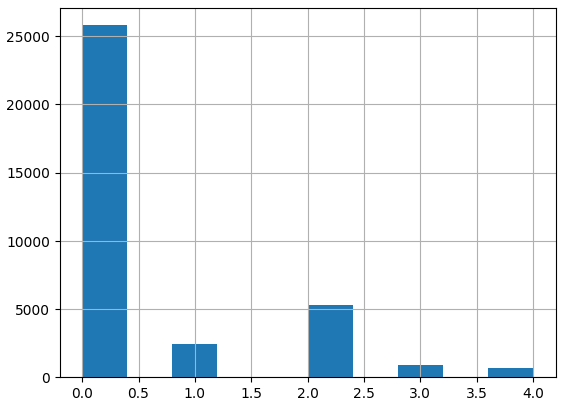

Como la clase 0 tiene muchos elementos, decidimos recortarlos, y dejar un aproximado de 4000 imágenes. Esto hizo que la distribución de las imágenes sea mas pareja.

.tamaño de clases con menos elementos de tipo 0
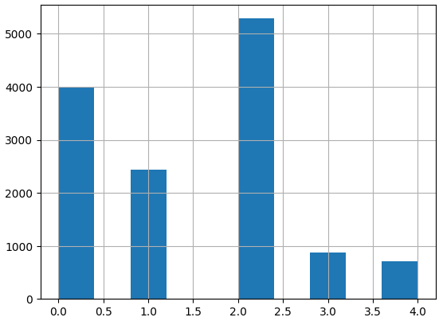

En este caso, las clases siguen estando desbalanceadas, pero como las clases 3 y 4 tienen muy pocos elementos y no queríamos minimizar tanto la cantidad de datos, decidimos probar con esta distribución para ver si funcionaba.

Luego leímos las imágenes, guardándolas a todas en una lista. Acá es donde surgió el primer problema: la lectura para imágenes de más de 100x100 pixeles no se podía hacer, ya que se llenaba la memoria y se cortaba la ejecución del programa. Las imágenes de 100x100 pixeles tardaban demasiado en cargar, lo que hacía que el programa sea inutilizable. Por este motivo, decidimos que la resolución de las imágenes sea de 50x50 pixeles.

Dividimos a las imágenes y sus etiquetas en tres conjuntos, uno de entrenamiento, otro de validación, y otro de prueba. El conjunto de entrenamiento se utiliza para que la IA aprenda y reconozca patrones. El de validación se utiliza para que, en su entrenamiento, la IA analice esas imágenes, con la finalidad de calcular su nivel de error. El conjunto de prueba se utiliza para, luego del entrenamiento, utilizar a la IA para que prediga los resultados de estas imágenes, y verificar su funcionamiento.
El conjunto de entrenamiento corresponde a un 65% de la totalidad de las imágenes, el de validación corresponde a un 15%, y el de prueba corresponde al 20% restante. Cada imagen fue normalizada, es decir, los valores de todos los pixeles fueron establecidos en el rango [0, 1].

Luego, las imágenes y etiquetas fueron convertidas a un formato reconocible por la IA, llamado _tensor_.

Cuando visualizamos las imágenes, nos dimos cuenta que la resolución de las imágenes era demasiado baja para que los humanos podamos detectar alguna anomalía en ellas. Sin embargo, procedimos igualmente a analizarlas con un modelo convolucional y uno denso.

El entrenamiento de ambos modelos fue demasiado lento, y con niveles de exactitud muy bajos, y niveles de error tenía una tendencia a descender, pero seguía en valores altos. Esto sugería que la IA no aprendía. Ambos modelos tenían resultados muy similares, lo que no debería suceder ya que son modelos distintos.

[cols="a,a", frame=none, grid=none, role=right]
|===
|   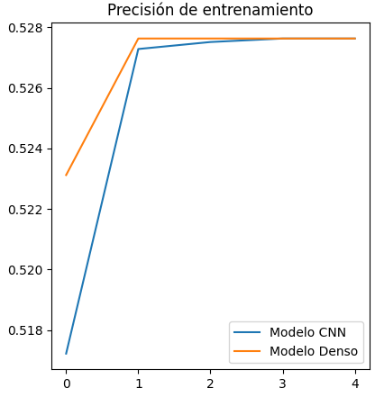
|   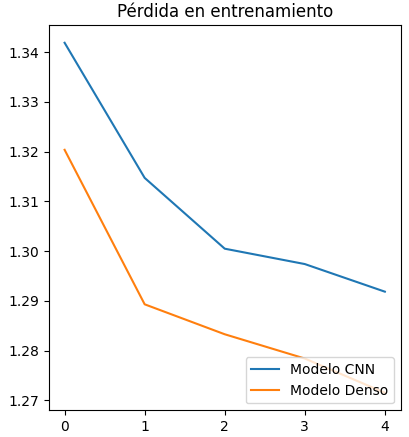
|===

Agregar o eliminar capas de neuronas, balancear más las clases o reconfigurar los hiperparámetros de ambos modelos no sirvió, por lo que probamos con una técnica llamada _aumento de datos_. Esta técnica consiste en "deformar" las imágenes, cambiando su iluminación, zoom, rotación, etcétera. Se utiliza para mejorar el entrenamiento de los modelos de IA de análisis de imágenes, ya que aumenta el número de imágenes de entrenamiento y su variedad. Sin embargo, esto tampoco funcionó.

Luego de analizar y probar diversas técnicas, determinamos que el problema elegido escapa nuestro alcance, ya que las imágenes deberían analizarse a mayor resolución, por lo que se necesitan mas recursos, que no tenemos.

Como el objetivo del trabajo es crear un modelo de IA con fines médicos, decidimos cambiar el enfoque del proyecto. Nuestro nuevo objetivo es detectar si un lunar es benigno o maligno a partir de una imagen. Debido a que seguimos utilizando imágenes, podemos reutilizar todo el trabajo ya desarrollado, cambiando la fuente de datos. Esto hace que el tiempo final de desarrollo se reduzca considerablemente.

== Detección de lunares benignos y malignos

El nuevo propósito de nuestro sistema radica en la detección precisa de lunares benignos y malignos a través del análisis de imágenes. Estas imágenes son adquiridas de la página web https://www.kaggle.com/[Kaggle], concretamente del conjunto de datos disponible en https://www.kaggle.com/datasets/fanconic/skin-cancer-malignant-vs-benign[Skin Cancer: Malignant vs. Benign]. Este conjunto específico consta de un total de 2637 imágenes utilizadas para el entrenamiento, distribuidas en 1440 imágenes de lunares benignos y 1197 imágenes de lunares malignos. Además, se dispone de 660 imágenes para llevar a cabo pruebas, compuestas por 360 imágenes de lunares benignos y 300 imágenes de lunares malignos.

=== Pre-Entrenamiento

Antes de llevar a cabo el entrenamiento del modelo, fue necesario ejecutar una serie de pasos para asegurar su viabilidad y efectividad. Inicialmente, procedimos a descargar todas las imágenes disponibles desde la página web previamente mencionada. No realizamos un recorte en la cantidad de imágenes, debido a que ambas clases tenían aproximadamente la misma cantidad de elementos.

Posteriormente, organizamos estas imágenes en listas separadas, categorizándolas en función de si serían destinadas para el entrenamiento o la fase de pruebas. En este caso no utilizamos imágenes de validación, debido a la reducida cantidad de imágenes del dataset. Además, aplicamos una estandarización en las dimensiones, ajustando cada imagen a un formato de 100x100 pixeles. Este enfoque se eligió para evitar consumir excesiva memoria RAM en el entorno de Google Colab.

Durante su lectura, cada imagen fue etiquetada en consecuencia. Aquellas que representaban lunares benignos se etiquetaron con un valor de 0, mientras que las imágenes de carácter maligno se etiquetaron con un valor de 1. Las etiquetas se colocaron en listas que se corresponden por posición a las de las imágenes. Es decir, a la imagen que está en la posición 0, le corresponde la etiqueta en la posición 0, a la imagen que está en la posición 1, le corresponde la etiqueta que está en la posición 1, lo mismo con las demás.

Con el propósito de evitar sesgos en el modelo, implementamos una etapa de mezcla de las imágenes. Esta mezcla se llevó a cabo de manera que las etiquetas continuaran alineadas correctamente. De esta manera, se evitó que el modelo recibiera secuencias de imágenes en las que las muestras benignas o malignas estuvieran agrupadas en bloques.

Además, llevamos a cabo una etapa de normalización en las imágenes. Esta normalización ajustó los valores de los píxeles en un rango entre 0 y 1, lo que resulta fundamental para un procesamiento y entrenamiento más eficiente del modelo.

Una vez completados estos pasos, estuvimos en condiciones de comenzar con el proceso de entrenamiento y llevar a cabo pruebas para evaluar el rendimiento del modelo resultante.

=== Entrenamiento de modelos

Realizamos el entrenamiento de redes neuronales densas y convolucionales. Este caso no es un caso de clasificación multiclase, si no, que es un caso de clasificación binaria. Es decir, debemos determinar si un lunar el benigno o no, por lo que hay solo dos opciones. En consecuencia, todos los modelos desarrollados tienen la misma capa de salida: una capa densa, con una neurona, y función de activación Sigmoid, que se utiliza para clasificación binaria. También, los modelos están compilados con la métrica `loss='binary_crossentropy'`, por este mismo motivo, y en su compilación, se utiliza el optimizador `adam`, ya que en las pruebas arrojó mejores resultados.

Las métricas que analizaremos de cada modelo son:

* _precisión de entrenamiento y pruebas:_ Se refiere al porcentaje de aprendizaje según los datos de entrenamiento y los de validación en cada vuelta de entrenamiento. Es decir, a cuántas predicciones en porcentaje acertó en el proceso de entrenamiento.
* _pérdida de entrenamiento y pruebas:_ Se refiere al porcentaje de error según los datos de entrenamiento y los de validación en cada vuelta de entrenamiento. Es decir, a cuántas predicciones en porcentaje falló en el proceso de entrenamiento.

A continuación, compartiremos las configuraciones específicas de parámetros que empleamos para estas distintas redes, así como aquella que determinamos como el modelo óptimo.

==== Red neuronal densa

La red neuronal densa tiene una capa de entrada de 10,000 neuronas, correspondiendo cada una de estas a un píxel de la imagen de 100x100 píxeles. Cuenta con tres canales, para analizar imágenes a color. A continuación se tienen dos capas ocultas que contienen 150 neuronas cada una, las cuales analizan los datos de las neuronas de entrada. Por último, como se mencionó, consta de una sola neurona de salida, la cual determina con un 1 o un 0 (redondeando los resultados intermedios) si el lunar de la imagen analizada es maligno o benigno.

//lo dejamos??
.arquitectura de la red densa
[source, python]
----
modelo_denso = tf.keras.models.Sequential([
    tf.keras.layers.Flatten(input_shape = (100, 100, 3)),
    tf.keras.layers.Dense(150, activation = 'relu'),
    tf.keras.layers.Dense(150, activation = 'relu'),
    tf.keras.layers.Dense(1, activation = 'sigmoid'),
])

#Compilación
modelo_denso.compile(optimizer='adam',
              loss='binary_crossentropy',
              metrics=['accuracy'])
----

Este modelo es simple, ya que, después de diversas pruebas, determinamos que es el que mejor funciona dentro de los modelos densos que analizamos. Sin embargo, los resultados obtenidos en el entrenamiento son muy favorables. Podemos observar que la precisión llegó casi al 80%, tanto en entrenamiento como en pruebas; y la pérdida está debajo del 60%.

[cols="a,a", frame=none, grid=none, role=right]
|===
|   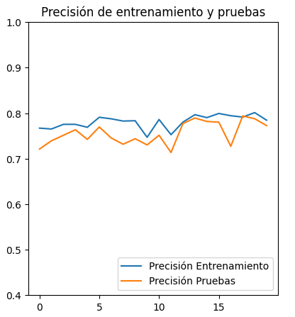
|   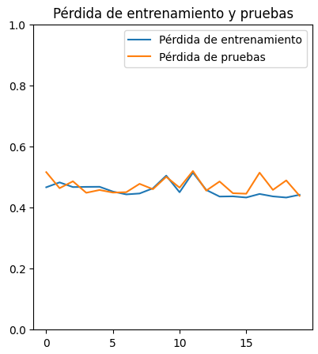
|===

La precisión máxima a la que se llegó con este modelo, con 20 vueltas de entrenamiento, es de 78%. Esto implicaría un alto nivel de precisión, pero las redes neuronales densas pierden el contexto de las imágenes dadas, por lo que al procesar información que se encuentra fuera de los rasgos de las imágenes de entrenamiento pierde eficacia y precisión.

==== Red neuronal convolucional

La red neuronal convolucional tiene una capa de entrada de tipo _convolucional_. Esta capa analiza la imagen en clústeres de 3x3 píxeles, asignándole un valor numérico a cada pixel. Luego, la capa de _pooling_ comprime la imagen, manteniendo las características más importantes de la misma, dadas por los valores de los pixeles. Esta información pasa a través de la capa de _dropout_, la cual modifica los resultados de los nodos a los cuales se dirigen los resultados, para evitar sobrecompensación en los resultados.

Para que los datos puedan ser analizados por las capas densas de la red, deben estar en una dimensión. La capa _flatten_ transforma el vector de tres canales correspondiente a la imagen, en un vector de un canal. Luego, las capas densas procesan la información, llevándola a la capa de salida. Ésta consta de una sola neurona que determina con un 1 o un 0 si el lunar es maligno o benigno.

.arquitectura de la red convolucional
[source, python]
----
modelo_cnn = tf.keras.models.Sequential([
    tf.keras.layers.Conv2D(16, (3, 3), activation = 'relu', input_shape = (100, 100, 3)),
    tf.keras.layers.MaxPooling2D(3, 3),

    tf.keras.layers.Dropout(0.5),
    tf.keras.layers.Flatten(),
    tf.keras.layers.Dense(64, activation = 'relu'),
    tf.keras.layers.Dropout(0.2),
    tf.keras.layers.Dense(32, activation = 'relu'),
    tf.keras.layers.Dropout(0.5),
    tf.keras.layers.Dense(1, activation = 'sigmoid')
])

#Compilación
modelo_cnn.compile(optimizer='adam',
              loss='binary_crossentropy',
              metrics=['accuracy'])
----

Esta arquitectura fue elegida luego de diversas pruebas con distintos tipos de arquitectura para un modelo de este tipo. Dado nuestro problema, es la que mas rápido se entrena, ya que a mayor cantidad de capas mayor tiempo de entrenamiento; y es la que arrojó mejores resultados.

Dadas las características de las capas convolucionales, se puede intuir que es recomendable usarlas para el análisis de imágenes, ya que permiten añadir contexto espacial a la predicción del modelo neuronal. Los resultados obtenidos fueron muy favorables, ya que llegó a un 85% de precisión, con 20 vueltas de entrenamiento. El nivel de error se mantuvo, tanto en entrenamiento como en pruebas, por debajo del 40%. Esto es una mejora considerable con respecto al modelo anterior.

[cols="a,a", frame=none, grid=none, role=right]
|===
|   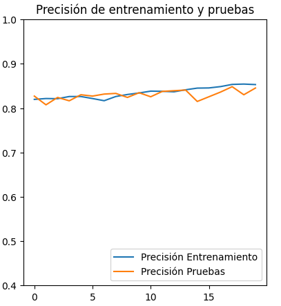
|   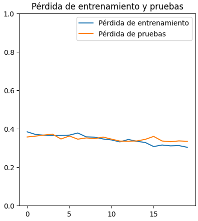
|===

Este modelo, por sí solo, es lo suficientemente eficaz para nuestro problema. Sin embargo, realizamos unas pruebas utilizando aumento de datos con la finalidad de mejorar incluso más estos resultados.

==== Red neuronal convolucional con aumento de datos

Para realizar esta prueba, definimos el siguiente generador de datos:

.generador de datos
[source, python]
----
generador_datos = ImageDataGenerator(
    rotation_range = 50,
    width_shift_range = 0.1,
    height_shift_range = 0.1,
    shear_range = 15,
    zoom_range = [0.9, 1.0],
    horizontal_flip = True,
    vertical_flip = True
)

generador_datos.fit(imagenes_entrenamiento)
----

Este generador define diversos valores de cambio para las imágenes, que luego son procesadas mediante el método `fit()`.

Estas imágenes fueron utilizadas para entrenar al modelo convolucional visto anteriormente. Sin embargo, no dio los resultados esperados.

[cols="a,a", frame=none, grid=none, role=right]
|===
|   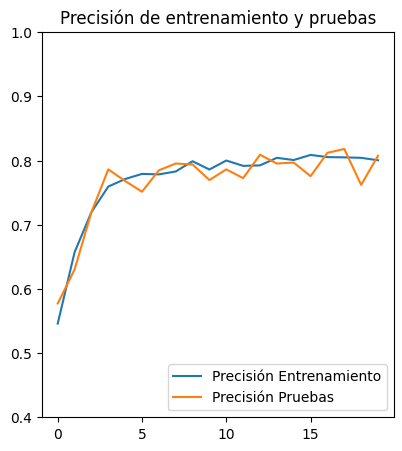
|   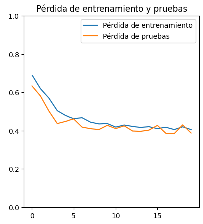
|===

Como podemos ver, no hay una mejora con respecto al modelo convolucional antes visto, por lo que nos propusimos mejorar estos resultados modificando la red neuronal.

Luego de diversas pruebas, el modelo que mejor funciona con aumento de datos para este tipo de problema, es una mejora del modelo denso visto inicialmente, añadiendole capas de convolusión y pooling.

.modelo cnn ad (aumento de datos)
[source, python]
----
modelo_cnn_ad = tf.keras.models.Sequential([
    tf.keras.layers.Conv2D(16, (3, 3), activation = 'relu', input_shape = (100, 100, 3)),
    tf.keras.layers.MaxPooling2D(2, 2),

    tf.keras.layers.Dropout(0.5),
    tf.keras.layers.Flatten(),
    tf.keras.layers.Dense(150, activation = 'relu'),
    tf.keras.layers.Dense(150, activation = 'relu'),
    tf.keras.layers.Dense(1, activation = 'sigmoid')
])

#Compilación
modelo_cnn_ad.compile(optimizer='adam',
              loss='binary_crossentropy',
              metrics=['accuracy'])
----

Sin embargo, como podemos observar, no mejora al modelo convolucional tradicional. La precisión llega, como máximo, al 82%. Creemos que esto sucede debido a que las imágenes ya son lo suficientemente variadas, y deformarlas solo agrega complejidad al problema.

[cols="a,a", frame=none, grid=none, role=right]
|===
|   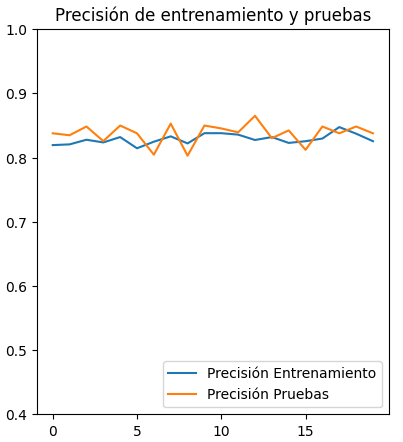
|   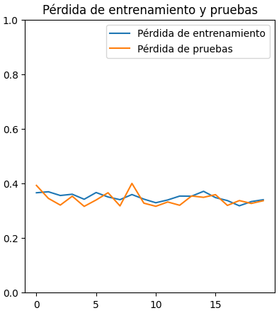
|===

No obstante, es un muy buen modelo en caso de que se desee utilizar.

=== Modelo óptimo

Se puede llegar finalmente a la conclusión de que para la tarea a completar, la cual consiste en analizar fotos, es más óptima la red neuronal convolucional. Esto se debe a que presenta un nivel mayor de precisión y permite que con el entrenamiento presentado para el modelo pueda intuir y determinar un resultado de una imagen con la cual no entrenó y que no sea completamente similar a un dato de entrenamiento.

Entrando en más detalle, la red neuronal densa en su aprendizaje puede llegar a un 78% de precisión, pero este resultado no se presenta en el testeo con datos aleatorios de los cuales no aprendió, lo que genera una variación grande en los resultados de sus predicciones. Por otra parte, la red neuronal convolucional con aumento de datos genera buenas predicciones, pero sus porcentajes son menores, y requiere más preprocesamiento de las imágenes.

La red neuronal convolucional tarda más que la red neuronal densa, y menos que la red neuronal convolucional con aumento de datos; y llega a un porcentaje de precisión del 81%, el cual también se traslada a ejemplos del mundo real, con datos aleatorios que no se encontraban en los datos de entrenamiento. A su vez, por el tipo de aprendizaje de contexto en las imágenes, permite una mayor consistencia en sus resultados, el cual también es 81%.

Si comparamos gráficamente los tres modelos podemos observar que el que mejores resultados arroja es el modelo convolucional sin aumento de datos.

[cols="a,a", frame=none, grid=none, role=right]
|===
|   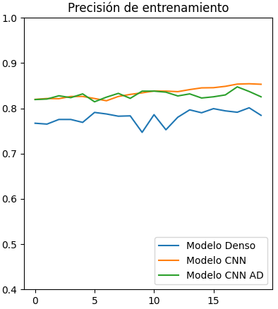
|   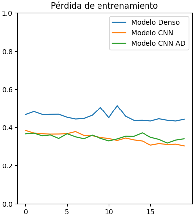
|===

Con una prueba de 660 imágenes, siendo 360 de tipo 0 y 300 de tipo 1, obtuvimos los siguientes resultados:

----
Predicciones del modelo denso
21/21 [==============================] - 0s 22ms/step
Predicciones: 660
Tipo 0: 289 correctas, 71 incorrectas
Tipo 1: 178 correctas, 122 incorrectas
Total: 467 correctas, 193 incorrectas

Predicciones del modelo convolutivo
21/21 [==============================] - 1s 53ms/step
Predicciones: 660
Tipo 0: 298 correctas, 62 incorrectas
Tipo 1: 263 correctas, 37 incorrectas
Total: 561 correctas, 99 incorrectas

Predicciones del modelo convolutivo con aumento de datos
21/21 [==============================] - 1s 62ms/step
Predicciones: 660
Tipo 0: 299 correctas, 61 incorrectas
Tipo 1: 254 correctas, 46 incorrectas
Total: 553 correctas, 107 incorrectas
----

Podemos observar que el modelo denso tiene un porcentaje de error de aproximadamente 30%, el modelo convolutivo tiene un porcentaje de error de 15%, y el modelo convolutivo con aumento de datos tiene un porcentaje de error de aproximadamente 17%.

Por estos motivos, determinamos que el modelo óptimo es el modelo convolutivo sin aumento de datos.

== Conclusión

En conclucion pudimos determinar que un aproach de analizis de imagen es plausible pero de intenso uso de recursos, por ende el objetivo principal que se tuvo planeado tuvo que cambiarse a uno menos intenso. Al determinar esto, pudimos observar que nuestro aproach sobre el modelo puede utilizarse para el problema principal que se plantea actualmente, esto nos permitio ahorrar tanto tiempo como esfuerzo y costos.

Sespues analizando los diferentes modelos que se utilizaron, se determino que el modelo de Deep Learning con capas convolucionales es el modelo optimo para el modelo que se quiere entrenar en base a precision y tiempo de entrenamiento. Esto se debe a la incorporacion contextual sobre el analizis de las imagenes, pudiendo asi analizar a mayores grandes rasgos patrones en ves de solamente comparar con probematicas ya vistas. a su ves se determino que el modelo convolucional con aumento de datos no aporta ningun beneficio tangible en comparacion al modelo convolucional comun y a su ves requiere mas tiempo de entrenamiento. Asi mismo la red neuronal densa no tampoco ofrece la precicion que el modelo selecionado tiene aunque esta requiera menos tiempo para entrenar.

